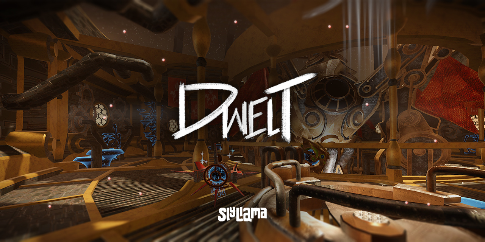

# Dwelt

**An environment-driven puzzle RPG about robot cartels and essences of emotion.** In the world of _Dwelt_, the valuable essences of emotion trafficked by the Order of Scrappers are locked within portals to strange landscapes of memory and feeling, which line the walls of their infinitely labyrinthine dwelling. In order to unlock and extract this essence and trade it on a lucrative black market, you and your cohort must negotiate the emotional skeletons of these geographies, bringing them closure by traversing their spans and depths, and solving the puzzles and riddles which encapsulate their feelings, hopes, and trauma. Yet questions remain: what are these portals? Where do they come from?

And how is it even possible that you, Scrapper, are here to gaze upon a labyrinth torn from the universe by the Cosmos Itself?
